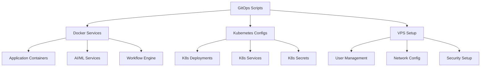
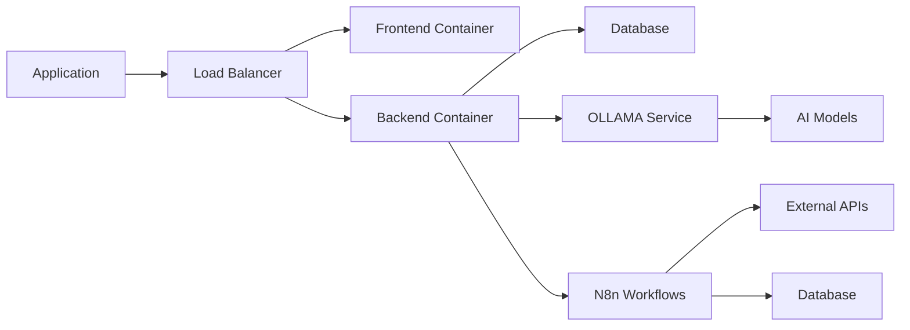
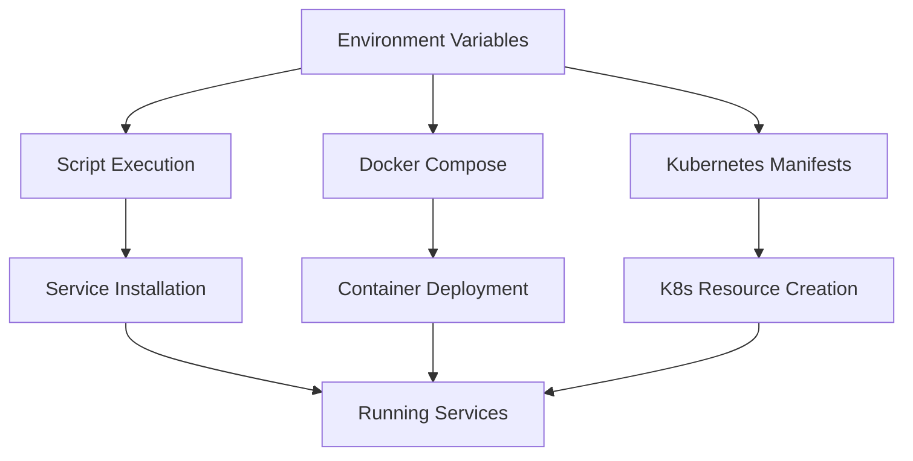

# System Patterns: GenericSuite GitOps

## System Architecture

### High-Level Architecture
GenericSuite GitOps follows a **modular, platform-agnostic architecture** that provides consistent deployment patterns across different infrastructure targets:

```
GenericSuite GitOps
├── Platform Adapters (VPS, K8s, Local)
├── Service Integrations (Docker, AI/ML, N8n)
├── Infrastructure Utilities (Network, Security, Monitoring)
└── Configuration Management (Environment, Secrets, Templates)
```

### Core Architectural Principles
1. **Platform Abstraction**: Common interfaces that work across VPS, Kubernetes, and local environments
2. **Service Modularity**: Each service (OLLAMA, N8n, etc.) is independently deployable and configurable
3. **Configuration Externalization**: All environment-specific settings managed through external configuration
4. **Infrastructure as Code**: All infrastructure defined in version-controlled scripts and configurations

## Key Technical Decisions

### Deployment Strategy: Multi-Target Support
**Decision**: Support three primary deployment targets with consistent patterns
- **Local Linux Servers**: Local Linux servers for development and testing
- **VPS Deployment**: Direct Docker Compose deployment on virtual private servers
- **Kubernetes Deployment**: Container orchestration for production scalability
- **Local Development**: Developer workstation setup with full service stack

**Rationale**: Different use cases require different infrastructure, but consistent tooling reduces cognitive load and maintenance burden.

### Configuration Management: Environment Variable Strategy
**Decision**: Use environment variables as the primary configuration mechanism
- `.env` files for local development
- Kubernetes secrets for production
- Shell environment variables for script execution

**Rationale**: Environment variables provide platform-agnostic configuration that works across containers, Kubernetes, and shell scripts.

### Script Language: Shell Script Foundation
**Decision**: Use shell scripts (bash/zsh) as the primary automation language
- Python for complex data processing utilities
- YAML for Kubernetes and Docker Compose configurations
- Shell scripts for orchestration and system interaction

**Rationale**: Shell scripts provide maximum compatibility across Unix-like systems and integrate naturally with system administration tasks.

### Container Strategy: Docker-First Approach
**Decision**: Containerize all services using Docker
- Docker Compose for local and VPS deployments
- Kubernetes for production orchestration
- Consistent container images across all environments

**Rationale**: Containers provide consistent runtime environments and simplify dependency management across different deployment targets.

## Design Patterns in Use

### Service Directory Pattern
Each service follows a consistent directory structure:
```
service_name/
├── README.md           # Service documentation
├── Makefile            # Service Makefile
├── install_service.sh  # Installation and setup
├── run_service.sh      # Service execution
├── docker-compose.yml  # Container configuration
├── .env.example        # Configuration template
├── service_config/     # Service-specific configurations
└── utilities/          # Helper scripts
```

**Benefits**: 
- Predictable organization
- Easy maintenance and updates
- Consistent user experience across services

### Template and Placeholder Pattern
Configuration files use placeholder replacement for customization:
```yaml
# Example from k8/deployment.yml
metadata:
  name: exampleappfront
spec:
  selector:
    app: exampleappfront
  # Replace exampleapp with actual project name
  # Replace exampleapp_docker_account with Docker Hub account
```

**Benefits**:
- Generic templates work for multiple projects
- Clear customization points
- Reduced duplication across similar configurations

### Environment-Based Configuration Pattern
All configurable values externalized to environment variables:
```bash
# From docker-compose.yml
environment:
  - REACT_APP_API_URL=$APP_REACT_APP_API_URL
  - APP_DB_URI=$APP_DB_URI
  - APP_SECRET_KEY=$APP_SECRET_KEY
```

**Benefits**:
- No secrets in version control
- Easy environment-specific customization
- Container-friendly configuration approach

### Idempotent Script Pattern
All scripts designed to be safely re-runnable:
```bash
# Check if service already exists before creating
if ! docker ps | grep -q service_name; then
    docker run -d --name service_name ...
fi
```

**Benefits**:
- Safe to re-run scripts during troubleshooting
- Supports incremental deployments
- Reduces deployment failures from partial state

## Component Relationships

### Core Infrastructure Components


### Service Integration Architecture


### Configuration Flow


## Critical Implementation Paths

### Local Linux Server Path
1. **Server Preparation**: User creation, group setup, security configuration
2. **Docker Installation**: Container runtime setup and configuration
3. **Application Deployment**: Container deployment with Docker Compose
4. **Service Orchestration**: Multi-container application startup and health checks
5. **Network Configuration**: Firewall rules, port forwarding, external access

### VPS Deployment Path
1. **Server Preparation**: User creation, group setup, security configuration
2. **Docker Installation**: Container runtime setup and configuration
3. **Application Deployment**: Container deployment with Docker Compose
4. **Service Orchestration**: Multi-container application startup and health checks
5. **Network Configuration**: Firewall rules, port forwarding, external access

### Kubernetes Deployment Path
1. **Cluster Setup**: Minikube installation or cluster connection
2. **Secret Management**: Kubernetes secrets creation and configuration
3. **Resource Deployment**: Deployment, Service, and ConfigMap creation
4. **Service Exposure**: Load balancer and ingress configuration
5. **Health Validation**: Pod status and service availability checks

### Local Development Path
1. **Dependency Installation**: Docker, Python, and service-specific tools
2. **Service Setup**: Individual service installation and configuration
3. **Development Stack**: Complete local environment with all services
4. **Development Workflow**: Hot reloading, debugging, and testing setup
5. **Integration Testing**: End-to-end testing with full service stack

### AI/ML Service Integration Path
1. **GPU Detection**: Hardware capability assessment
2. **Model Installation**: AI model download and setup
3. **Service Configuration**: Memory, GPU, and network configuration
4. **API Exposure**: REST API setup for application integration
5. **Performance Monitoring**: Resource usage and performance tracking

## Security Architecture Patterns

### User and Permission Management
```bash
# Standard user creation pattern
create_user() {
    local username=$1
    local group=$2
    
    # Create user with minimal privileges
    useradd -m -s /bin/bash -G $group $username
    
    # Set up SSH access if needed
    setup_ssh_access $username
    
    # Configure sudo permissions if required
    configure_sudo_access $username $group
}
```

### Secrets Management Pattern
- **Development**: `.env` files (not in version control)
- **VPS**: Environment variables in deployment scripts
- **Kubernetes**: Kubernetes secrets with base64 encoding
- **CI/CD**: Pipeline secret management integration

### Network Security Pattern
```bash
# Firewall configuration pattern
configure_firewall() {
    # Default deny all
    ufw --force reset
    ufw default deny incoming
    ufw default allow outgoing
    
    # Allow specific services
    ufw allow ssh
    ufw allow $APP_PORT
    
    # Enable firewall
    ufw --force enable
}
```

## Performance and Scalability Patterns

### Resource Optimization
- **Container Resource Limits**: CPU and memory limits for all containers
- **Multi-Stage Builds**: Optimized Docker images with minimal runtime footprint
- **Service Scaling**: Horizontal scaling patterns for Kubernetes deployments
- **Caching Strategies**: Layer caching for Docker builds and dependency caching

### Monitoring and Observability
- **Health Check Endpoints**: Standard health check patterns for all services
- **Log Aggregation**: Centralized logging for troubleshooting and monitoring
- **Metrics Collection**: Resource usage and performance metrics
- **Alerting Integration**: Integration points for monitoring and alerting systems

### Deployment Strategies
- **Rolling Updates**: Zero-downtime deployment patterns
- **Blue-Green Deployment**: Environment switching for major updates
- **Canary Releases**: Gradual rollout patterns for risk mitigation
- **Rollback Procedures**: Quick rollback mechanisms for failed deployments