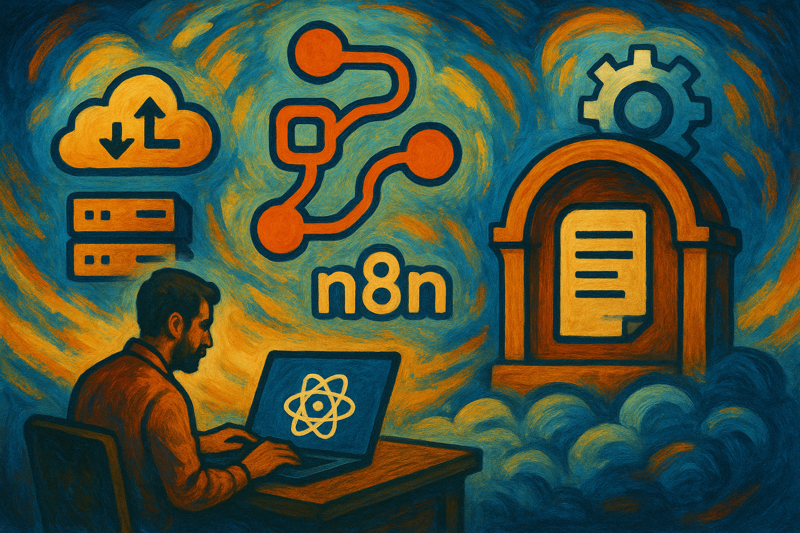

# Generic Suite N8N module




The Generic Suite N8N module provides the scripts and configurations needed to deploy a local N8N service.

[n8n](https://n8n.io/) is a workflow automation and collaboration platform for teams.

## Overview

This module brings up a fully functional local n8n stack using Docker Compose, including:

- n8n (workflow automation)
- PostgreSQL (database)
- pgAdmin (optional DB UI)

It is designed for repeatable operations via `Makefile` targets.

## Table of Contents

- [Features](#features)
- [Technologies](#technologies)
- [Getting Started](#getting-started)
- [Usage](#usage)
- [Environment Variables](#environment-variables)
- [Project Structure](#project-structure)
- [License](#license)
- [Contributing](#contributing)
- [Credits](#credits)

## Features

- __One-command run/stop__ of the n8n stack with Docker Compose.
- __Update__ images for n8n, Postgres, and pgAdmin.
- __Logs__ viewing for n8n and Postgres.
- __Open/Close firewall__ helpers for Linux hosts.
- __Quick shell access__ into n8n and Postgres containers.

## Technologies

- [Docker](https://www.docker.com/)
- [Docker Compose](https://docs.docker.com/compose/)
- [Make](https://www.gnu.org/software/make/)
- [n8n](https://n8n.io/)
- [PostgreSQL](https://www.postgresql.org/)
- [pgAdmin](https://www.pgadmin.org/)
- Bash helper scripts

## Getting Started

### Prerequisites

- [Docker](https://www.docker.com/)
- [Docker Compose](https://docs.docker.com/compose/)
- [Make](https://www.gnu.org/software/make/)
- Linux users: optional firewall commands require suitable privileges (sudo).

### Installation

From the repository root or this directory:

```bash
# from repository root
make -C n8n help

# or inside n8n/
make help
```

Configure n8n:

```bash
# from repository root
cd n8n

# copy and edit environment
cp .env.example .env
vi .env
```

Set the required environment variables (see [Environment Variables](#environment-variables)).

## Usage

All commands are provided via `Makefile`. Run `make help` to see targets.

```bash
# Run n8n stack in detached mode
make run

# Stop only (keeps containers)
make stop

# Stop and remove containers
make down

# View logs (n8n and postgres)
make logs

# Update n8n, postgres and pgAdmin images
make update

# Restart (down + run)
make restart

# Linux: open/close firewall for exposed ports
make open
make close

# Recreate containers forcefully
make force-recreate

# Shell into containers
make enter_pg      # postgres
make enter_n8n     # n8n
```

Default ports:

- n8n: `5678`
- Postgres: `5432`
- pgAdmin: `8080`

Access:

- n8n: http://localhost:5678
- pgAdmin: http://localhost:8080

## Environment Variables

The following variables are read by `docker-compose.yml`:

- `POSTGRES_USER`
- `POSTGRES_PASSWORD`
- `POSTGRES_DB`
- `POSTGRES_NON_ROOT_USER`
- `POSTGRES_NON_ROOT_PASSWORD`
- `PGADMIN_DEFAULT_EMAIL`
- `PGADMIN_DEFAULT_PASSWORD`
- `N8N_SECURE_COOKIE`
- `WEBHOOK_URL`

Copy from `.env.example` and adjust as needed.

## Project Structure

```
n8n/
├── Makefile                 # Entry points for all commands
├── README.md                # This file
├── docker-compose.yml       # n8n + Postgres + pgAdmin stack
├── init-data.sh             # DB initialization script mounted into Postgres
├── run_n8n.sh               # Helper script used by Make targets
└── supabase_test/           # (optional) test utilities
```

## License

This project is licensed under the MIT License. See the root [LICENSE](../LICENSE) file.

## Contributing

Contributions are welcome! Please open an issue or PR with a clear description and minimal reproduction if applicable.

## Credits

This project is developed and maintained by [Carlos J. Ramirez](https://github.com/tomkat-cr). For more information or to contribute to the project, visit [The GenericSuite GitOps on GitHub](https://github.com/tomkat-cr/genericsuite-gitops).

Happy Coding!
