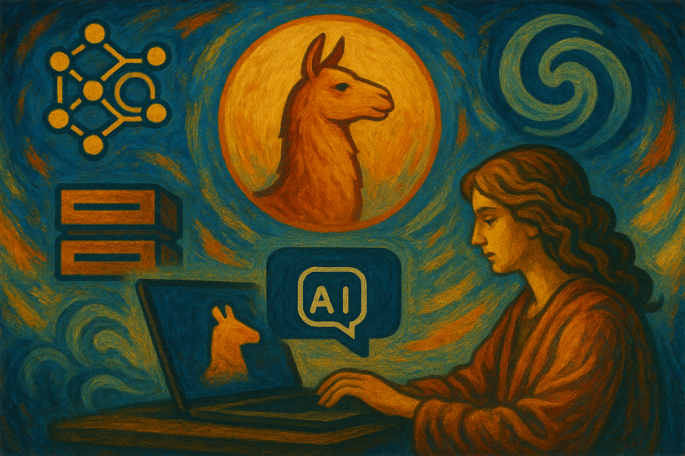

# Ollama & Open WebUI Toolkit




A collection of Bash scripts and Make targets to install, run, and manage:

- Ollama service (local LLM runtime)
- Open WebUI (web interface for LLMs, with optional GPU)
- Stable Diffusion WebUI (image generation)
- GPU monitoring helpers

This directory is designed for repeatable operations via `Makefile` targets.

## Table of Contents

- [Features](#features)
- [Technologies](#technologies)
- [Getting Started](#getting-started)
  - [Prerequisites](#prerequisites)
  - [Installation](#installation)
- [Usage](#usage)
  - [Ollama](#ollama)
  - [Open WebUI](#open-webui)
  - [Stable Diffusion](#stable-diffusion)
  - [GPU Watch](#gpu-watch)
- [Environment Variables](#environment-variables)
- [Project Structure](#project-structure)
- [License](#license)
- [Contributing](#contributing)
- [Credits](#credits)

## Features

- __Install/Update Ollama__ on Linux and configure firewall access.
- __Run/Stop Ollama__ quickly with make targets.
- __Run Open WebUI__ in Docker with or without GPU, open/close firewall, update via Watchtower.
- __Install/Run Stable Diffusion WebUI__ with pinned Python via Pyenv.
- __Watch GPU__ usage via `nvidia-smi`.

## Technologies

- [Make](https://www.gnu.org/software/make/)
- [Docker](https://www.docker.com/)
- [NVIDIA Container Toolkit](https://github.com/NVIDIA/nvidia-container-toolkit)
- [Ollama](https://ollama.com/)
- [Open WebUI](https://openwebui.com/)
- [Stable Diffusion WebUI](https://github.com/AUTOMATIC1111/stable-diffusion-webui) ([AUTOMATIC1111](https://en.wikipedia.org/wiki/Automatic1111) fork)
- [systemd](https://systemd.io/) (for Ollama service management)

## Getting Started

### Prerequisites

- Linux system with `systemd` (for Ollama service control).
- `bash`, `curl`, `sed`, `grep` available.
- Docker installed and running.
- Optional GPU support:
  - NVIDIA GPU with drivers installed.
  - NVIDIA Container Toolkit for Docker (automated by the `open-webui` install target).
- For Stable Diffusion: ability to install packages via `apt` (Debian/Ubuntu) or `yum/dnf` (RHEL/CentOS/Fedora).

> Note: Some operations open/close firewall ports using `../scripts/firewall_manager.sh` and detect OS via `../scripts/get_os_name_type.sh` from the repository root. Run commands from within this `ollama/` directory so relative paths resolve.

### Installation

From the repository root or this directory:

```bash
# from repository root
make -C ollama help

# or inside ollama/
make help
```

Install Ollama (Linux):

```bash
make ollama_install
```

Install NVIDIA Container Toolkit for Open WebUI GPU support (Debian/RHEL handled by script):

```bash
make webui_install
```

Install Stable Diffusion prerequisites and WebUI:

```bash
make stable_diffusion_install
```

## Usage

All commands are provided as Make targets. Use `make help` to view the `Makefile`.

### Ollama

```bash
# Start Ollama service (via `ollama` CLI). Stops previous service first.
make ollama_run

# Stop Ollama service (tries systemd, then killall fallback)
make ollama_stop

# Install/Update Ollama on Linux
make ollama_install
make ollama_update

# Open/Close firewall for OLLAMA_PORT (default 11434)
make ollama_open
make ollama_close

# Configure systemd to listen on all interfaces (0.0.0.0:11434) and restart service
make open_ollama_port_to_lan
```

Defaults used by scripts:

- `OLLAMA_PORT=11434`
- `RUN_WITH_GPU=1` (not directly used by Ollama, but exported for consistency)

### Open WebUI

```bash
# Run (recreates container). Uses CUDA image when RUN_WITH_GPU=1, otherwise CPU image.
make webui_run            # maps $WEBUI_PORT:8080 (default 3000)

# Stop and remove container
make webui_stop

# One-time install of NVIDIA Container Toolkit (Debian/RHEL) and Docker runtime config
make webui_install

# Update Open WebUI images and re-run container
make webui_update

# Update via Watchtower (run-once) for the `open-webui` container
make webui_update_watchtower

# Open/Close firewall for WEBUI_PORT (default 3000)
make webui_open
make webui_close
```

Defaults used by scripts:

- `WEBUI_PORT=3000`
- `RUN_WITH_GPU=1` to use `ghcr.io/open-webui/open-webui:cuda`; set `RUN_WITH_GPU=0` to use `:main` (CPU).

Examples:

```bash
# Run Open WebUI on port 8081 without GPU
WEBUI_PORT=8081 RUN_WITH_GPU=0 make webui_run

# Open firewall on that port
WEBUI_PORT=8081 make webui_open
```

### Stable Diffusion

```bash
# Install Stable Diffusion WebUI (AUTOMATIC1111) with Python 3.10 via pyenv
make stable_diffusion_install

# Run Stable Diffusion (listens on all interfaces, API enabled)
make stable_diffusion_run
```

> The install script sets up `pyenv`, installs Python `3.10`, downloads `webui.sh`, and runs with `--listen --api`.

### GPU Watch

```bash
make watch_gpu    # runs: watch -n 0.5 nvidia-smi
```

## Environment Variables

- __OLLAMA_PORT__: Ollama service port. Default: `11434`.
- __WEBUI_PORT__: Open WebUI host port. Default: `3000` (container listens on 8080).
- __RUN_WITH_GPU__: `1` to enable GPU (`--gpus all` / CUDA image), `0` for CPU-only. Default: `1`.

Set them inline before `make`, e.g. `WEBUI_PORT=8081 RUN_WITH_GPU=0 make webui_run`.

## Project Structure

```
ollama/
├── Makefile                       # Entry points for all commands
├── README.md                      # This file
├── install_ollama_service.sh      # Install Ollama (Linux), open firewall
├── install_stable_diffusion.sh    # Install Stable Diffusion with pyenv Python 3.10
├── open_ollama_port_to_lan.sh     # Configure systemd to listen on 0.0.0.0:11434
├── run_ollama.sh                  # Run/Stop/Install/Update/Open/Close Ollama
├── run_stable_diffusion.sh        # Run Stable Diffusion WebUI
├── run_webui.sh                   # Manage Open WebUI Docker container
└── watch_gpu.sh                   # GPU utilization watcher
```

> Uses helper scripts from `../scripts/` such as `firewall_manager.sh` and `get_os_name_type.sh`.

## License

This project is licensed under the MIT License. See the root [LICENSE](../LICENSE) file.

## Contributing

Contributions are welcome! Please open an issue or PR with a clear description and minimal reproduction if applicable.

## Credits

This project is developed and maintained by [Carlos J. Ramirez](https://github.com/tomkat-cr). For more information or to contribute to the project, visit [The GenericSuite GitOps on GitHub](https://github.com/tomkat-cr/genericsuite-gitops).

Happy Coding!